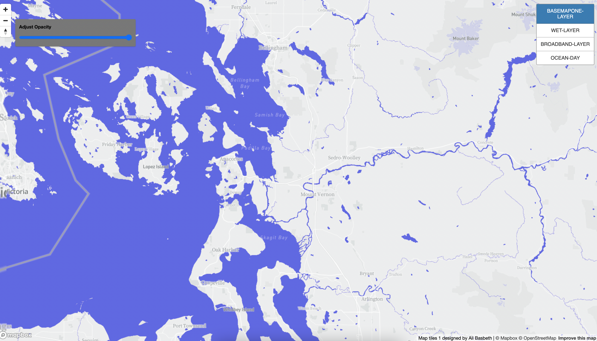

# Basemap Design and Tiles Generation  

## Lab Project 4 SPR 2022

Map Design is one of the topic in digital geography; understanding tiles, and designing basemap are all important part of map making. This project then exposes students to the concept of "map tiles", and how to generate them from web-based mapping platform like MapBox, and propriety GUI of QGIS. To make it clear, here is the definition of map tiles:

    "A tile map is a map in which each region is represented by a single 
    tile of the same shape and size. 
    For example, a square tile map of the United States would consist
    of square tiles of the same size for each state, regardless
    of the geographic area of each state".

    

For this lab assignment, I have decided to create four distinct maps which I developed on MapBox Studio. The map can be accessed [here](https://lostgovernment.github.io/Map-Tiles-Design-Lab4-geog458/)

1. The picture shows the first basemap that I created. It has 14 different zoom levels, with the lowest at 1, and the highest is at 14. The basemap that I created is based off personality, the color white to light gray, and blue-ish are two of my favorite color. I believe that by designing the water to be this blue will make readers attracted to this map, because it is a very interesting color contrast. Additionally, the contrast will make it easy to differentiate between water and land. For instance, we can see the Skagit river clearly.
Another important thing in regard to the color that I chose for this map is that blue represents the clean water of puget sounds, and the Salish sea where the Southern resident killer whale inhabit. 

        Zoom Level 1 is equivalent to 
        512 Map Width and Height(pixels)	
        78,271.5170 Ground Resolution (meters / pixel)
        1 : 295,829,355.45 Map Scale(at 96 dpi)

        The largest zoom level 14 is equivalent to 
        4,194,304	Map Width and Height(pixels)
        9.5546 Ground Resolution (meters / pixel)
        1 : 36,111.98 Map Scale(at 96 dpi)

2. The Broadband Speed Test is the theme of the map below. It is limited to only washington state. The cyan color dots represent each broadband that has been tested, and it shows different area especially in between western Washington. 

        The available zoom level for this map is ranging from:
        Zoom level 1 to 16. 

        The 16 zoom level is the largest and it has 
        16,777,216	Map Width and Height (pixels)
        2.3887G round Resolution (meters / pixel)
        1 : 9,028.00 Map Scale(at 96 dpi)

3. The third tiles that I created is a thematic map layer that shows the internet speed testing site across the Washington state. The map is the combination of the first tile, and the second tile. 
        Zoom Level 1 is equivalent to 
        512 Map Width and Height(pixels)	
        78,271.5170 Ground Resolution (meters / pixel)
        1 : 295,829,355.45 Map Scale(at 96 dpi)

        The largest zoom level 14 is equivalent to 
        4,194,304	Map Width and Height(pixels)
        9.5546 Ground Resolution (meters / pixel)
        1 : 36,111.98 Map Scale(at 96 dpi)

4. This base map tile is called "Wetlands and Parks in Cities", the zoom is limited to area around bellevue. The zoom size  ranges from 1 to 14. The reason why I created this thematic map is because I have been writing several papers throughout my college careers on issue regarding the environtment. In this particular map, I created a map that display wetlands in the WA state, as development getting larger, the environmental cost that included in the development is massive. Therefore, with this map I hope that people that lives in king county, Bellevue, Seattle, Renton, and the surrounding area can be more aware about the environment. 
        Zoom Level 1 is equivalent to 
        512 Map Width and Height(pixels)	
        78,271.5170 Ground Resolution (meters / pixel)
        1 : 295,829,355.45 Map Scale(at 96 dpi)

        The largest zoom level 14 is equivalent to 
        4,194,304	Map Width and Height(pixels)
        9.5546 Ground Resolution (meters / pixel)
        1 : 36,111.98 Map Scale(at 96 dpi)

#### Techology Used
1. MapBox Studio : <https://www.mapbox.com/mapbox-studio>
2. QGIS: <https://qgis.org/en/site/>
3. Mapbox GL JS: <https://docs.mapbox.com/mapbox-gl-js/guides/>

#### Acknowledgement
This project is part of the Lab Assignmnent for GEOG 458: Digital Geography. The project would not be made possible without the help of Professor Bo Zhao, and Teaching Assistant Steven Bao. 

Additionally the dataset for the second and third tiles originated from:
<https://data.wa.gov/Demographics/Broadband-Speed-Tests/rsqh-kx83>

###### Works cited: 
- CRAN. 'What is a tile map'?[online].

    Available at: <https://cran.r-project.org/web/packages/tilemaps/vignettes/tilemaps.html#:~:text=A%20tile%20map%20is%20a,geographic%20area%20of%20each%20state.>