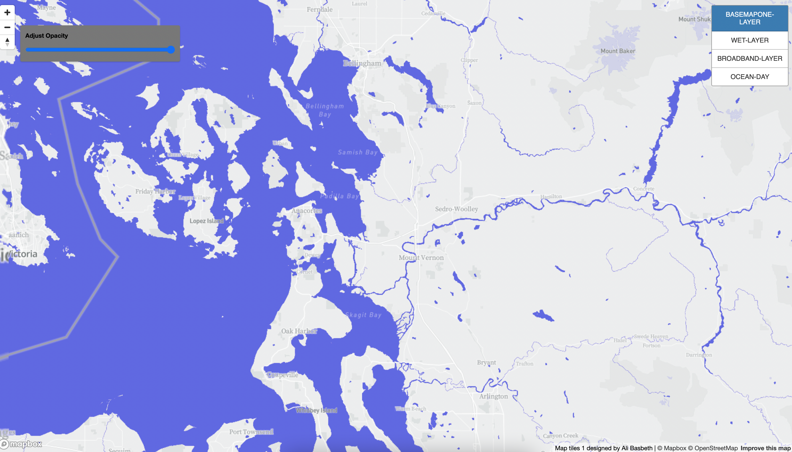

# Basemap Design and Tiles Generation  

## Lab Project 4 SPR 2022

Map Design is one of the topic in digital geography; understanding tiles, and designing basemap are all important part of map making. This project then exposes students to the concept of "map tiles", and how to generate them from web-based mapping platform like MapBox, and propriety GUI of QGIS. To make it clear, here is the definition of map tiles:

    "A tile map is a map in which each region is represented by a single 
    tile of the same shape and size. 
    For example, a square tile map of the United States would consist
    of square tiles of the same size for each state, regardless
    of the geographic area of each state".

    

For this lab assignment, I have decided to create four distinct maps which I developed on MapBox Studio. 

1. The picture shows the first basemap that I created. It has 14 different zoom levels, with the lowest at 1, and the highest is at 14. The basemap that I created is based off personality, the color white to light gray, and blue-ish are two of my favorite color. I believe that by designing the water to be this blue will make readers attracted to this map, because it is a very interesting color contrast. Additionally, the contrast will make it easy to differentiate between water and land. For instance, we can see the Skagit river clearly.
Another important thing in regard to the color that I chose for this map is that blue represents the clean water of puget sounds, and the Salish sea where the Southern resident killer whale inhabit. 

        Zoom Level 1 is equivalent to 512(pixels)	
        78,271.5170 9.5546 Ground Resolution (meters / pixel)
        1 : 295,829,355.45 Map Scale(at 96 dpi)

        The largest zoom level 14 is equivalent to 
        4,194,304	Ground Resolution (meters / pixel)
        9.5546 Map Scale(at 96 dpi)

2. The Broadband Speed Test is the theme of the map below. It is limited to only washington state. The cyan color dots represent each broadband that has been tested, and it shows different area especially in between western and eastern Washington. 

3. The third map 

4. This base map is called "Wetlands and Parks in Cities", the zoom is limited to area around bellevue. The zoom can be 

#### Techology Used
1. MapBox Studio : <https://www.mapbox.com/mapbox-studio>
2. QGIS: <https://qgis.org/en/site/>
3. Mapbox GL JS: <https://docs.mapbox.com/mapbox-gl-js/guides/>

#### Acknowledgement
This project is part of the Lab Assignmnent for GEOG 458: Digital Geography. The project would not be made possible without the help of Professor Bo Zhao, and Teaching Assistant Steven Bao. 

###### Works cited: 
- CRAN. 'What is a tile map'?[online].

    Available at: <https://cran.r-project.org/web/packages/tilemaps/vignettes/tilemaps.html#:~:text=A%20tile%20map%20is%20a,geographic%20area%20of%20each%20state.>